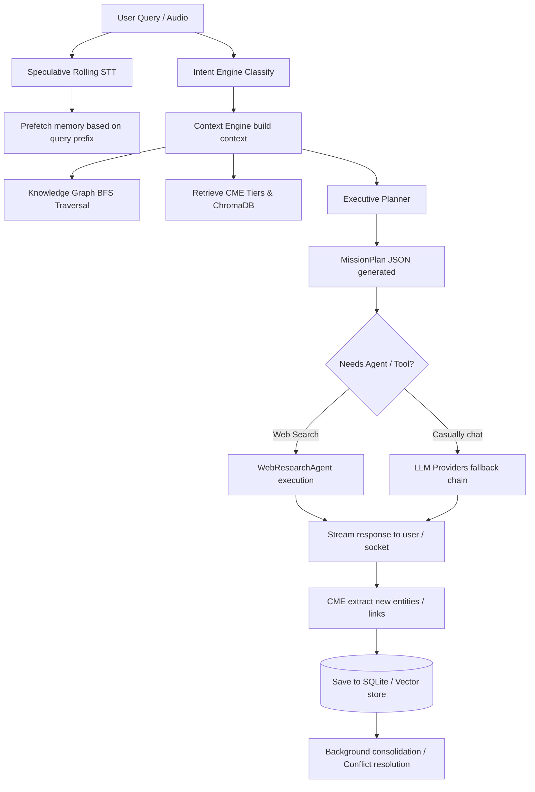

# AI_ARCHITECTURE

> **Purpose**: Explain the AI agent orchestration, reasoning flow, and memory systems.
> **Scope**: AI logic, model routing, memory tiers, and tool calling.
> **Last Updated**: 2026-08-03
> **Related Documents**: [ARCHITECTURE.md](./ARCHITECTURE.md), [BACKEND_ARCHITECTURE.md](./BACKEND_ARCHITECTURE.md)

## Quick Summary
FRIDAY uses a multi-agent framework routed by a central **Router Agent** and **Executive Planner**. The system integrates a multi-layered Cognitive Memory Engine (CME V2) and semantic Knowledge Graph to make highly context-aware decisions, execute tools asynchronously, and stream voice duplex updates.

## Reasoning Flow

## Core Reasoning Frameworks

### 1. Intent Engine & Executive Planner
- **Intent Classifier**: Parses the query and maps it to target categories (e.g., Casual Chat, Planning, Goal Creation, Automation).
- **Executive Planner**: 
  - Gathers context, reads tool registries, and runs risk analyses.
  - Returns a structured `MissionPlan` JSON containing primary/secondary objectives, subtasks with priorities, necessary tools, risk scores, expected results, and fallback strategies.
  - Automatically decomposes multi-step plans into Goals, Milestones, and Tasks stored in the DB as a Directed Acyclic Graph (DAG).
- **Execution Scheduler**: Tracks task statuses and dependencies, executing parallel ready tasks using background workers.

### 2. Cognitive Memory Engine (CME) V2
FRIDAY maintains context across multiple memory tiers:
1. **Short-Term Context**: Immediate session-specific message windows.
2. **Working Memory**: In-memory semantic facts extracted during the ongoing conversation turn.
3. **Long-Term Context**: Semantic facts stored in SQLite database tables and indexed in ChromaDB vector store for similarity search.
- **Consolidation**: A background process merges duplicates and extracts summarized entity details.
- **Conflict Resolver**: Automatically resolves attribute conflicts using source confidence scores and updated timestamps.

### 3. Knowledge Graph Engine
- Tracks semantic entity nodes (e.g. Person, Application, Project, Location) and relationship link edges (e.g. works_on, created_by).
- **Traversal Engine**: Resolves BFS decay maps (giving decaying context weights based on hop distance), computes shortest paths, expands node neighborhoods, and infers transit paths.
- **Explainability**: Generates natural language sentences explaining *how* two nodes are connected in the graph.

### 4. Identity Engine & Registry
- Disambiguates entities and resolves aliases to canonical registry IDs.
- Tracks audit trail changes, confidence scores, and builds structured profiles.

### 5. Duplex WebSocket Voice Integration
- Accepts floating-point 16kHz PCM audio bytes from the client.
- **Speculative STT**: Transcribes audio buffer arrays every 800ms to send partial transcripts back to the client.
- **Barge-in / Interruption Detection**: Monitors incoming websocket command frames. If an `interrupt` command is received, it sets an interrupted flag and instantly cancels the active LLM text generation and speech synthesis tasks, providing a responsive experience.
