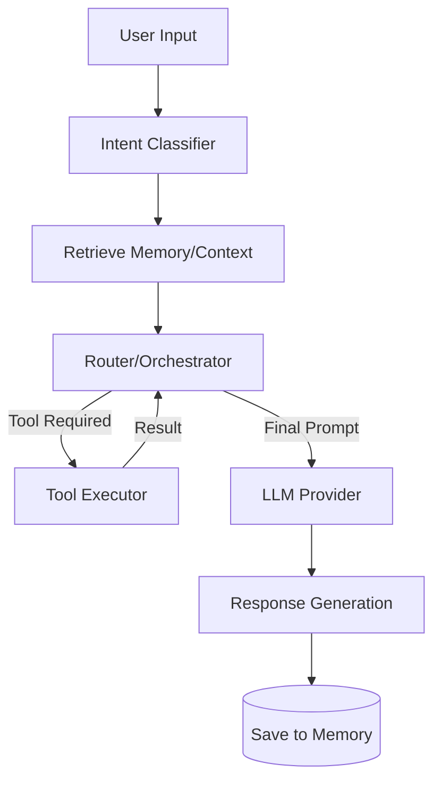

# AI_ARCHITECTURE

> **Purpose**: Explain the AI agent orchestration, reasoning flow, and memory systems.
> **Scope**: AI logic, model routing, and tool calling.
> **Last Updated**: 2026-07-13
> **Related Documents**: [ARCHITECTURE.md](./ARCHITECTURE.md), [BACKEND_ARCHITECTURE.md](./BACKEND_ARCHITECTURE.md)

## Quick Summary
FRIDAY uses a Router Agent design pattern. The core logic relies on an orchestrator that evaluates user input, fetches relevant context from Memory, decides whether to use Tools, and selects the most appropriate LLM for the task.

## The Router Agent
The Router is the brain. It does not execute a single prompt; rather, it manages a workflow:
1. **Intent Classification**: Is this a casual chat, a complex request, or a command to execute a tool?
2. **Model Routing**: 
   - Simple tasks -> Fast, smaller model (e.g., Claude Haiku / GPT-4o-mini).
   - Complex reasoning -> Advanced model (e.g., Claude 3.5 Sonnet / GPT-4o).
3. **Execution**: Sends the prompt, handles tool calls, and formulates the final response.

## Reasoning Flow

## Memory System
FRIDAY implements multiple tiers of memory:
1. **Short-Term Context**: The immediate conversation window (last N messages).
2. **Working Memory**: Facts extracted during the current session (e.g., "User is driving right now").
3. **Long-Term Memory**: Persistent facts stored in a Vector DB or summarized profiles (e.g., "User prefers concise answers", "User lives in New York").

## Tool Calling
The agent is provided with schemas for various tools (e.g., Calendar, Weather, File System). The LLM natively outputs tool calls, which the backend intercepts, executes securely, and returns the result to the LLM for final response synthesis.

## Voice Integration
- **STT (Speech-to-Text)**: Converts audio stream to text as fast as possible (e.g., Whisper, Deepgram).
- **TTS (Text-to-Speech)**: Converts agent text back to audio (e.g., ElevenLabs, OpenAI TTS). Must support streaming output to reduce time-to-first-byte (TTFB).

## Future Multi-Agent System
The architecture is designed to evolve into a Swarm/Multi-Agent system where the Router delegates tasks to specialized sub-agents (e.g., a Coding Agent, a Research Agent, a Scheduling Agent) rather than handling everything in a single monolithic prompt.
