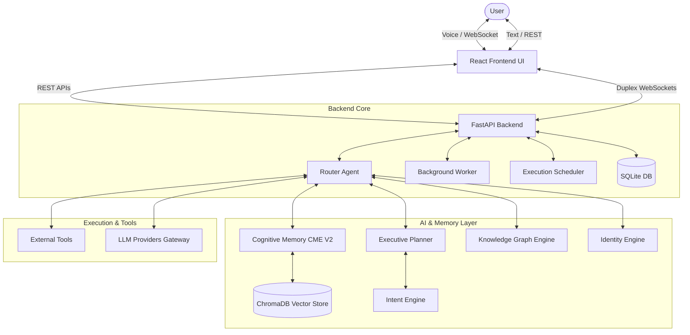

# ARCHITECTURE

> **Purpose**: Explain the entire end-to-end architecture of FRIDAY.
> **Scope**: High-level system design and component interaction.
> **Last Updated**: 2026-08-03
> **Related Documents**: [FRONTEND_ARCHITECTURE.md](./FRONTEND_ARCHITECTURE.md), [BACKEND_ARCHITECTURE.md](./BACKEND_ARCHITECTURE.md), [AI_ARCHITECTURE.md](./AI_ARCHITECTURE.md)

## Quick Summary
FRIDAY uses a decoupled architecture with a React-based frontend (Vite), a FastAPI backend for high-performance routing, and an AI reasoning layer handling memory, planning, and task execution.

## High-Level Architecture Diagram

## Core Components

### 1. Frontend
- **Responsibility**: Rendering the Orb, managing UI states (Listening, Processing, Speaking, Idle), and capturing/streaming raw microphone audio inputs, playing back text-to-speech WAV streams.
- **Tech Stack**: React 19, Tailwind CSS v4, Framer Motion (for fluid animations), Lucide React.

### 2. Backend (FastAPI)
- **Responsibility**: API routing, WebSockets for duplex voice stream, executing planning DAGs, managing SQLite transactions, and coordinating AI logic.
- **Tech Stack**: Python, FastAPI, Pydantic v2, SQLite, ChromaDB.

### 3. AI / Reasoning Layer
- **Executive Planner**: Parses intent and decomposes complex queries into Milestone-Task DAGs.
- **Cognitive Memory (CME V2)**: Coordinates short-term, working, and long-term memories with background consolidation.
- **Knowledge Graph**: Tracks relationships between semantic entities.
- **Identity Engine**: Resolves canonical entity identities and aliases.

### 4. Background Job & Task Execution
- **Scheduler**: Periodically re-evaluates goal structures and schedules tasks.
- **Worker Queue**: Handles asynchronous CPU/IO tasks (e.g. model downloading, web research summaries) to keep FastAPI responsive.

## Future Infrastructure
- **Desktop/Mobile**: Packaging the frontend in Electron or Tauri for global shortcut integration.
- **Local LLMs**: Integrating local models (via Ollama or Llama.cpp) for offline and fast-response operations.
- **Tool Sandbox**: Running command and file execution tasks in isolated Docker containers for safety.
