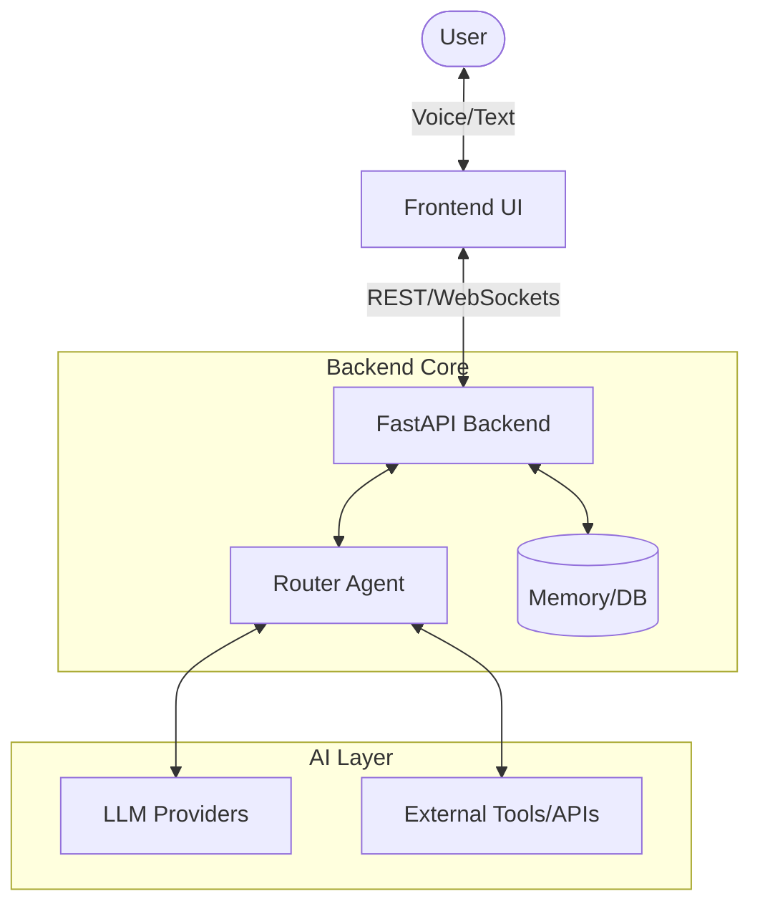

# ARCHITECTURE

> **Purpose**: Explain the entire end-to-end architecture of FRIDAY.
> **Scope**: High-level system design and component interaction.
> **Last Updated**: 2026-07-13
> **Related Documents**: [FRONTEND_ARCHITECTURE.md](./FRONTEND_ARCHITECTURE.md), [BACKEND_ARCHITECTURE.md](./BACKEND_ARCHITECTURE.md), [AI_ARCHITECTURE.md](./AI_ARCHITECTURE.md)

## Quick Summary
FRIDAY uses a decoupled architecture with a React-based frontend (Vite/Next.js), a FastAPI backend for high-performance routing, and an AI agent layer handling LLM communications and memory.

## High-Level Architecture Diagram

## Core Components

### 1. Frontend
- **Responsibility**: Rendering the Orb, managing UI states (Listening, Thinking, Speaking), and handling audio input/output.
- **Tech Stack**: React, Tailwind CSS / Vanilla CSS modules, Framer Motion (for animations).

### 2. Backend (FastAPI)
- **Responsibility**: API routing, session management, WebSocket connections for real-time audio streams, and orchestrating the AI logic.
- **Tech Stack**: Python, FastAPI, Pydantic, SQLAlchemy.

### 3. AI / Router Agent
- **Responsibility**: Determining user intent, retrieving context from Memory, deciding which LLM provider to use, and invoking tools.
- **Tech Stack**: LangChain/LlamaIndex (or custom router), OpenAI/Anthropic APIs.

## Future Infrastructure
- **Desktop/Mobile**: Wrapping the frontend in Electron or React Native.
- **Local LLMs**: Integrating Ollama or MLX for completely private, offline, fast-response interactions.
- **Distributed Agents**: Evolving the Router Agent into a Swarm architecture for parallel processing.
